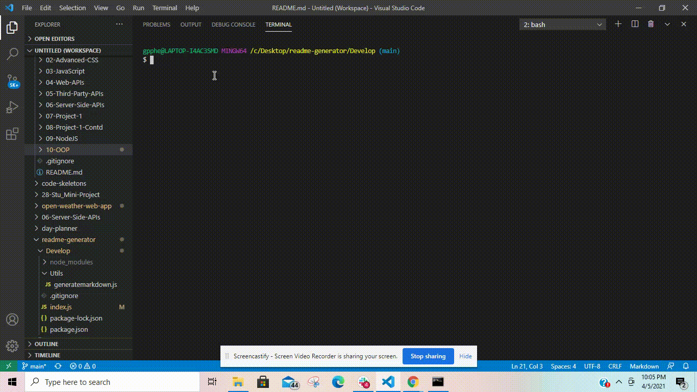

# readme-generator

## Description
Creating a quality readme is essential to the production of opensource web applications and projects. ReadMe files let others understand what the project is desgined to do as well as the methods that it uses to function. It also shows users how to contribute to the project or post an issue to the proect. This readme generator allows the user to quickly create a good readme.md file without having to type so much into their code editor, freeing up more time to actually code.

## Video Example
   
[Video Link](https://www.youtube.com/watch?v=VMj3xTuDJbE)
## Installation
Run [npm i] in the integrated terminal for the application.

## Usage
This is a command line application run through node.js that is invoked through the [node index.js] command. The user will then be prompted for answers to a series of questions that pertain to the information necessary for a good readme file.

## Licence 
MIT

## Contributors
Made by Gene Phelps II, 2021

## Repository 
https://github.com/Gpphelps/readme-generator